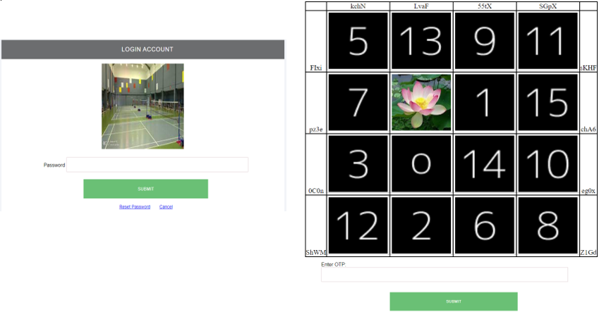
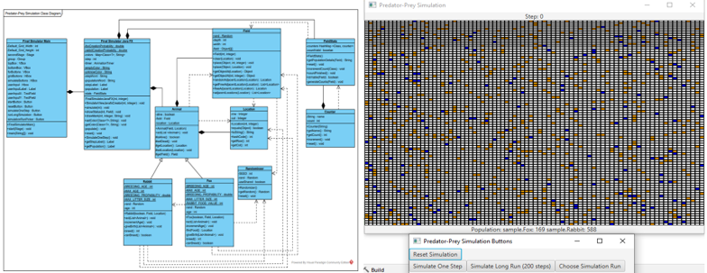
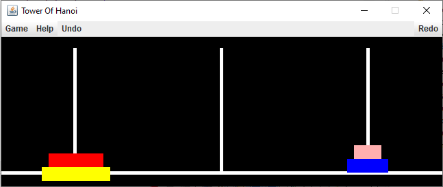

<h1>My Portfolio</h1>
<h2>About me</h2>
Hi there! I am Hifdzullah from Bandar Seri Begawan, Brunei Darussalam. I graduated with a Master's Degree in Computing and Information Systems, additionally, I earned my Bachelor of Degree in Computer Science with Honours from the University of Chester, UK. I have experience in many programming languages, such as HTML, CSS, Vue.js, Laravel PHP, Phyton, Java, Dart and SQL. I am experienced in developing websites and android mobile applications. I also had learnt to develop a simulation and game using the Java FX library. 

<h2>👨‍💻 Individual Software Development Projects:</h2>

- <b>Hybrid Graphical User Authentication Using Graphical One-Time-Password and Anchoring and Relay technique for Enhanced Password Security and Memorability for Web-Based Online Banking User Authentication</b> 
  I had built a web based hybird graphical user authentication for an online banking user authentication that utilized recall based graphical user authentication, recognition based graphical user authentication and dynamic grapical one-time password.
  - <strong>Recall based graphical authentication:</strong> The recall of password image is based on anchoring and relaying technique, where any object within the image is selected according to user selection and relay the meaning of the selected image based on user personal experiences.
  - <strong>Recognition based graphical authentication:</strong> Randomly shuffle two user selected image with decoy image within the 8 x 8 grid layout.
   - <strong>Dynamic graphical one-time password:</strong> Randomly generated graphical one time password , where the user must enter the OTP according to the location of user images and the given OTP locations. 
   
   
   
- <b>Android Mobile Application for Local Private Sector Job posting and Small Business Product Advertising</b>
  - <strong>Job searching:</strong> A platform for local private sectors to share information of job listing to the jobseekers.
  - <strong>Small business advertising:</strong> A platform for local small business to expose and to share information on selling their products to the public. 
  - <strong>Admin:</strong> Provide the administator with the capabilites to create, update, delete, and read.
    
   
   
<h2>👨‍💻 Teamwork Software Development Mini Project:</h2>

- <b>Desktop application for Predator Prey Simulation</b>
  - In this project i had designed the class diagram, the use case and assists in the development of desktop application for foxes and rabbit population simulation, this simulation features a real-time scenario of how the population of foxes and rabbit within the field varies over time. 
  - The development of the dektop application simulation is implemented using Object-oriented principles and JAVA FX library.
  
     
     
 - <b>Desktop application for Tower of Hanoi</b>   
   - In this project i had designed and created the class diagram, activity diagram, use case diagram and assists in the development of desktop application for Tower of Hanoi game.
   - The development of the dektop application game is implemented using Object-oriented principles and JAVA FX library.
   
     
 
     
   
