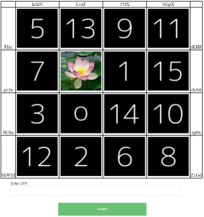

<h2>Hi, I'm Hifdzullah!</h2>

I am  a computer and information systems graduate, highly motivated and self-driven person who have the determination to achieve excellent results on any work or tasks in teamwork and independently. Very keen and willing to learn and seek to grow skills and experiences in IT. Interested in the area of software development, authentication security, and I’m currently learning on computer vision.

<h2>👨‍💻 Individual Software Development Projects:</h2>

- <b>Android Mobile Application for Local Non-goverment Job listing and Small Business Advertising</b>
  - <strong>Job searhing:</strong> A platoform for jobseekers to searchs for informations local job listings.
  - <strong>Small business advertising:</strong> A platform local small business to expose and share information of their products to the public. 
- <b>Hybrid Graphical User Authentication Using Graphical One-Time-Password and Anchoring and Relay technique for Enhanced Password Security and Memorability for Web-Based Online Banking User Authentication</b>
  - <strong>Three factor authentication:</strong> I had built a web application for an online banking user authentication that utilized three factor authentication that includes recall, recognition and OTP.
  - <strong>Recall based graphical authentication:</strong> The recall of password image is based on anchoring and relaying technique, where any object within the image is selected according to user selection and than relay the information based on person experiences of using that object.
  - <strong>Recognition based graphical authentication:</strong> A graphical one time password that are implemented with randomly shuffle user image and decoy image and randomly generated OTP within the 8 x 8 grid layout.
   
   
   
<h2>👨‍💻 Teamwork Software Development Mini Projects:</h2>

- <b>Desktop application for Predator Prey Simulation</b>
  - In this project i design the class diagram, use case for fox and rabbit simuation and assist in the development of desktop application for foxes and rabbit population simulation, this simulation features a real-time scenario of how the population of foxes and rabbit within the field varies over time. 
  - The development of the dektop application simulation is achieved using Object-oriented principles and JAVA FX.
  -  
  - 
   

<h2>Certification</h2>

- Microsoft Azure Fundamentals

<h2>Skills</h2>

- HTML
- CSS
- PHP
- JAVA
- Javascript
- SQL
- Python

<!--
**joshmadakor1/joshmadakor1** is a ✨ _special_ ✨ repository because its `README.md` (this file) appears on your GitHub profile.

Here are some ideas to get you started:

- 🔭 I’m currently working on ...
- 🌱 I’m currently learning ...
- 👯 I’m looking to collaborate on ...
- 🤔 I’m looking for help with ...
- 💬 Ask me about ...
- 📫 How to reach me: ...
- 😄 Pronouns: ...
- ⚡ Fun fact: ...
-->
