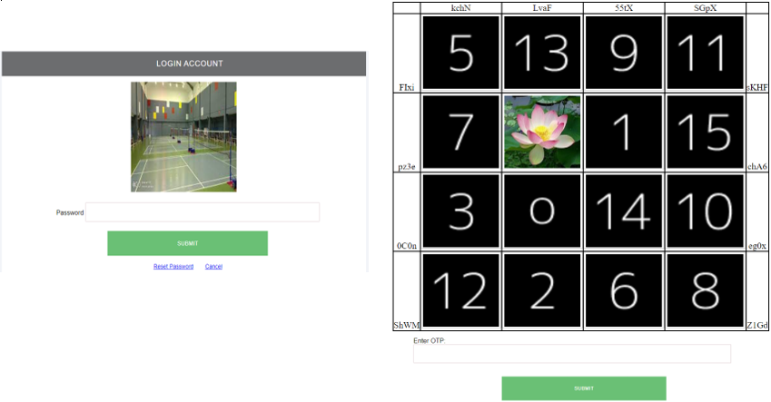
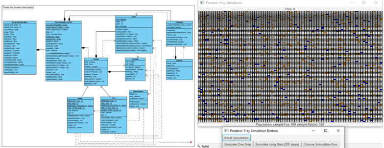
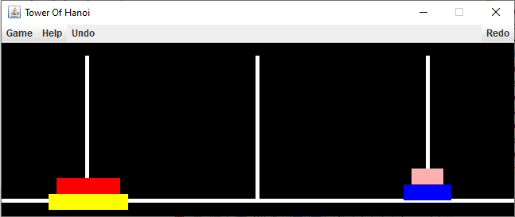

<h1>My Portfolio</h1>
<h2>About me</h2>
My name Hifdzullah from Bandar Seri Begawan, Brunei Darussalam. I hold a <b>Master's Degree in Computing and Information Systems</b> and <b>Bachelor of Science with Honours in Computer Science </b> from the University of Chester, United Kingdom. 
  
I have experience working with wide range of computer programming languages and technologies, such as HTML, CSS, Vue.js, Laravel PHP, Phyton, Java, Tensor Flow, Dart and SQL. My technical background includes <b>Front-end development, Backend system development, Mobile Application development and Computer Vision in Artificial Intelligence (AI)</b>. 
  
In addition, I have experience developing simulations and games using the <b>JavaFX</b>b>library, which strengthened my understanding of object-oriented programming, UI design, and application logic. 

<h2>👨‍💻 Individual Research Development Projects:</h2>

- <b>Hybrid Graphical User Authentication for Web-Based Online Banking Using Anchoring and Relaying Recall Techniques and Graphical One-Time Password</b> 
  <strong>Project Description:</strong> I developed a web-based hybrid graphical user authentication system for online banking, which integrates recall-based graphical authentication, recognition-based graphical authentication, and a dynamic graphical one-time password (OTP) mechanism.
  
<strong> Purpose of the system:</strong> The system was designed to enhance security and usability by combining <b>three core authentication components</b> reducing reliance on traditional text-based passwords.

<strong>Core Components:</strong>

 
  1.  <strong>Recall based graphical authentication:</strong>
      Users select meaningful objects within a password image and recall them by anchoring the objects to personal experiences and relaying their associated meanings, making the password memorable yet difficult to guess.
  2.  <strong>Recognition based graphical authentication:</strong>
      In this phase, <b>two registered images are randomly positioned among decoy images within an 8 × 8 grid layout</b>. The randomized placement ensures that image positions vary across sessions, enhancing security against shoulder surfing and pattern-based attacks.
  3.  <strong>Dynamic graphical one-time password:</strong>
      In this phase, the system generates a session-based random one-time password. User must enter the OTP according to the location of user images and the given OTP locations ensuring that each authentication attempt uses a unique One-Time-Password.
  
   
   
   
- <b>Android Mobile Application for Local Private Sector Job posting and Small Business Product Advertising</b>
  - <strong>Job searching:</strong> A platform for local private sectors to share information of job listing to the jobseekers.
  - <strong>Small business advertising:</strong> A platform for local small business to expose and to share information on selling their products to the public. 
  - <strong>Admin:</strong> Provide the administator with the capabilites to create, update, delete, and read.
    
   
   
<h2>👨‍💻 Teamwork Software Development Mini Project:</h2>

- <b>Desktop application for Predator Prey Simulation</b>
  - In this project i had designed the class diagram, the use case and assists in the development of desktop application for foxes and rabbit population simulation, this simulation features a real-time scenario of how the population of foxes and rabbit within the field varies over time. 
  - The development of the dektop application simulation is implemented using Object-oriented principles and JAVA FX library.
  
     
     
 - <b>Desktop application for Tower of Hanoi</b>   
   - In this project i had designed and created the class diagram, activity diagram, use case diagram and assists in the development of desktop application for Tower of Hanoi game.
   - The development of the dektop application game is implemented using Object-oriented principles and JAVA FX library.
   
     
 
     
   
